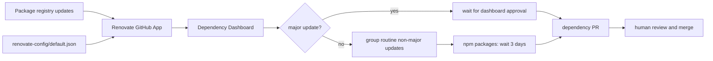

# Kaizen Agents Renovate Configuration

This repository stores shared Renovate defaults for `kaizen-agents-org`.

`default.json` is the organization's onboarding preset for repositories managed by the Mend Renovate GitHub App.

## Dependency Update Flow



## Default Policy

| Area | Setting | Effect |
|---|---|---|
| Base preset | `extends: ["config:recommended"]` | Starts from Renovate's recommended defaults. |
| Dashboard | `dependencyDashboard: true` | Creates a Dependency Dashboard issue for grouped visibility and approvals. |
| Labels | `labels: ["dependencies"]` | Labels Renovate PRs consistently. |
| PR rate | `prHourlyLimit: 2` | Caps update bursts. |
| PR concurrency | `prConcurrentLimit: 5` | Limits open dependency PR volume. |
| Major updates | `major.dependencyDashboardApproval: true` | Requires manual dashboard approval before major-version PRs. |
| Non-major grouping | package rule for `minor`, `patch`, `pin`, `digest` | Groups routine updates into fewer PRs. |
| npm release age | `minimumReleaseAge: "3 days"` | Waits before npm updates to avoid freshly published breakage. |
| Lockfiles | weekly maintenance before 5am Monday | Keeps lockfiles refreshed on a predictable cadence. |

Automerge is intentionally disabled by omission. The default posture is conservative: Renovate should prepare dependency PRs for review, not merge them automatically.

## Required Setup

1. Install the Mend Renovate GitHub App for `kaizen-agents-org`: <https://github.com/apps/renovate/installations/new>
2. Include this repository, `renovate-config`, in the installation.
3. Include every repository that should receive dependency update PRs:
   - `.github`
   - `builder-agent`
   - `coderabbit`
   - `kaizen-loop`
   - `verifier`
4. Let Renovate open onboarding PRs and merge the ones you want enabled.

## Consumer Repositories

Repositories can extend the shared preset from their own `renovate.json` when they need explicit local configuration:

```json
{
  "extends": ["github>kaizen-agents-org/renovate-config"]
}
```

Use local configuration for repository-specific schedules, managers, package rules, or ignore paths. Keep general organization policy in `default.json`.

## Change Guidelines

When changing `default.json`:

1. Keep the file valid JSON and keep the Renovate schema URL.
2. Prefer conservative defaults that work across the organization.
3. Do not enable automerge unless explicitly requested and documented in the PR.
4. Explain any broader PR-volume change, especially limits, grouping, or release-age changes.
5. Validate the file before opening a PR:

```sh
python3 -m json.tool default.json >/dev/null
```

This command is the minimum syntax check. When changing Renovate semantics, also validate against Renovate's configuration tooling or schema documentation. The repository's `.kaizen/config.yml` also checks that `extends` and `packageRules` remain arrays.
